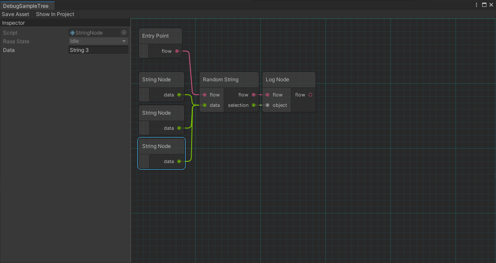

# Unity Utilities

This package provides easier access to NLP tools by exposing it via graph nodes. The goal of this project is to provide a complete suite of NLP tools directly through the Rasa Tree Flow Graph.

- [Unity Utilities](#unity-utilities)
  - [Installation](#installation)
  - [Support the project!](#support-the-project)
  - [Join the community!](#join-the-community)
  - [License](#license)
  - [References](#references)
  - [Credits](#credits)

## Installation

This package depends on:
- vx.util (UnityUtil)

1. Clone [UnityUtil](https://github.com/voxell-tech/UnityUtil.git) your project's `Packages` folder.
2. Clone this repository into your project's `Packages` folder.
3. And you are ready to go!

## Support the project!

## Join the community!

## License

This repository as a whole is licensed under the GNU Public License, Version 3. Individual files may have a different, but compatible license.

See [license file](./LICENSE) for details.

## References

- https://github.com/dbrizov/NaughtyAttributes

## Credits

Python Logo by [Jessica Williamson](https://www.behance.net/gallery/96750899/Python-Logo-Redesign):

